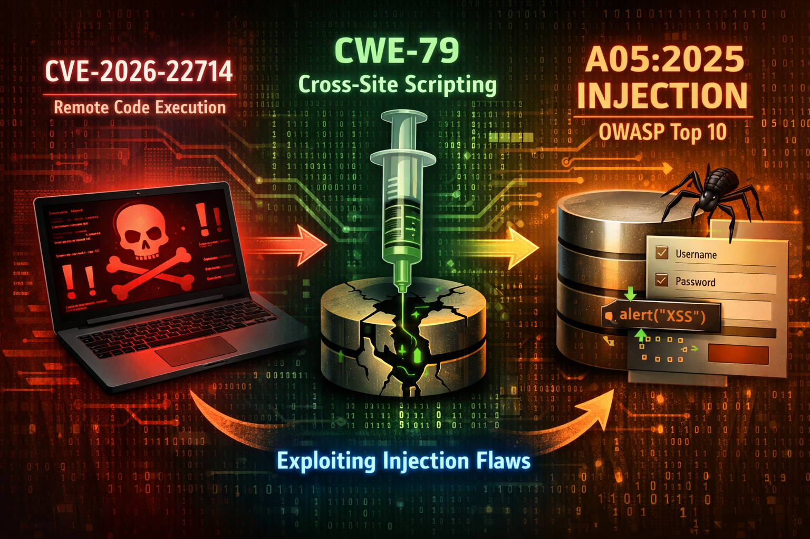

# Case: CVE-2026-22714

https://www.cvedetails.com/cve/CVE-2026-22714/  
https://www.cvedetails.com/cwe-details/79/Improper-Neutralization-of-Input-During-Web-Page-Generation-.html  
https://cwe.mitre.org/data/definitions/79.html  
https://owasp.org/Top10/2025/A05_2025-Injection/  

## 1. Conceptual relationship (top-down view)

You can think of the three items as **different abstraction layers describing the same security failure**:

**🔹 OWASP A05:2025 – Injection (category level)**

* A **high-level risk category**
* Describes *what goes wrong conceptually*
* Injection occurs when **untrusted input is interpreted as executable code**
* Includes SQL injection, command injection, **XSS**, template injection, etc.

---

**🔹 CWE-79 – Cross-Site Scripting (weakness level)**

* A **technical weakness pattern**
* Describes *how the injection manifests*
* Specifically:

  > Untrusted data is included in a web page without proper validation or encoding, allowing execution of attacker-controlled scripts in the victim’s browser.

---

**🔹 CVE-2026-22714 – Concrete vulnerability (instance level)**

* A **real, identifiable vulnerability**
* Describes *where and when the weakness exists*
* Tied to:

  * A specific product
  * A specific version
  * A specific attack surface
* Often exploitable due to **missing input validation, output encoding, or context awareness**

---

📌 **In short**

> **OWASP A05** explains the *class of risk* →  
> **CWE-79** explains the *technical flaw* →  
> **CVE-2026-22714** is the *real-world occurrence*  

---

## 2. How the same issue looks to different roles

### 🟥 Attacker perspective (offensive view)

**Mental model**

> “Can I make the application execute my code instead of just displaying my input?”

---

**What the attacker sees**

* An input field, URL parameter, HTTP header, or stored value
* Output that reflects user input back to the browser
* Lack of proper escaping or sanitization

---

**Practical exploitation path**

1. Identify a reflection point or stored content
2. Inject JavaScript payload (`<script>`, event handlers, template expressions)
3. Confirm execution in victim context
4. Escalate impact:

   * Session hijacking
   * Credential theft
   * Privilege escalation
   * CSRF chaining

---

**Mapping**

* “This CVE is exploitable”
* “The weakness is XSS (CWE-79)”
* “XSS is just one form of Injection (OWASP A05)”

---

👉 The attacker **does not care** about CWE or OWASP labels → They care about **execution and impact**.

---

### 🟦 Administrator / system owner perspective (operational view)

**Mental model**

> “What is the risk to my system and users, and how urgent is it?”

---

**What the administrator sees**

* A CVE identifier in:

  * Security advisories
  * Vulnerability scanners
  * ZAP / Nessus / vendor bulletins
* Severity scores (CVSS)
* Affected versions

---

**Key concerns**

* Is my deployment affected?
* Is there a patch or workaround?
* Can this be exploited remotely?
* Does it affect:

  * User data?
  * Authentication?
  * Trust in the system?

---

**Mapping**

* CVE-2026-22714 → *patch management task*
* CWE-79 → *root cause classification*
* OWASP A05 → *risk communication and reporting*

---

👉 For admins, OWASP and CWE help with **prioritization**,
but **CVE drives action**.

---

### 🟩 Developer perspective (engineering view)

**Mental model**

> “Why did this happen in the code, and how do I prevent it everywhere?”

---

**What the developer sees**

* A failure in:

  * Output encoding
  * Context-aware escaping
  * Input validation assumptions
* Possibly:

  * Manual string concatenation
  * Framework misuse
  * Missing security defaults

---

**Root-cause thinking**

* CWE-79 explains *the coding mistake*
* OWASP A05 explains *why this class of mistake is dangerous*
* CVE shows *the consequence of missing defenses*

---

**Developer-level prevention**

* Output encoding by context (HTML, JS, URL)
* Template auto-escaping
* Strict input handling
* Security headers (CSP as mitigation)
* Centralized encoding libraries

---
👉 For developers, **CWE is the most actionable**, OWASP provides **design guidance**, CVE provides **motivation and evidence**.

---

## 3. One sentence per role (summary)

* **Attacker:**
  *“This CVE lets me inject script code and run it in someone else’s browser.”*

* **Administrator:**
  *“This CVE represents an injection risk that must be patched to protect users.”*

* **Developer:**
  *“This vulnerability exists because CWE-79 was introduced through unsafe output handling.”*

---

## 4. Why this mapping is powerful

This tri-layer mapping is ideal because it:

* Separates **risk**, **weakness**, and **instance**
* Explains why:

  * OWASP is strategic
  * CWE is technical
  * CVE is operational
* Mirrors real-world workflows in:

  * Secure coding
  * Vulnerability management
  * Penetration testing

---

## Role-based mapping: Vulnerability perspective

| **Role**                         | **Primary Concerns**                                                                                                                                       | **Typical Actions**                                                                                                                                                                                       |
| -------------------------------- | ---------------------------------------------------------------------------------------------------------------------------------------------------------- | --------------------------------------------------------------------------------------------------------------------------------------------------------------------------------------------------------- |
| **Attacker**                     | - Can untrusted input be executed as code?   - Is the injection reflected, stored, or DOM-based?   - What privileges does execution grant?           | - Probe inputs (forms, parameters, headers)   - Inject JavaScript payloads   - Confirm execution in browser context   - Escalate to session hijacking, credential theft, or CSRF chaining        |
| **Administrator / System Owner** | - Is our system affected by **CVE-2026-22714**?   - What is the business and user impact?   - Is exploitation remote and unauthenticated?            | - Identify affected versions   - Apply patches or mitigations   - Disable vulnerable features if needed   - Monitor logs and alerts   - Communicate risk and remediation status               |
| **Developer**                    | - Where did unsafe data handling occur (**CWE-79**)?   - Why did validation or encoding fail?   - How can this class of issue be prevented globally? | - Fix output encoding in correct context   - Remove unsafe string concatenation   - Enable template auto-escaping   - Add security tests   - Refactor code to align with OWASP A05 principles |
| **Security Analyst / Pentester** | - How does this vulnerability fit known weakness patterns?   - Can it be reliably detected and reproduced?                                              | - Map findings to CWE and OWASP categories   - Reproduce exploit scenarios   - Assign severity (CVSS)   - Produce actionable remediation guidance                                                |
| **Management / Compliance**      | - Does this violate security policy or compliance requirements?   - Is user trust or legal exposure at risk?                                            | - Track remediation status   - Report risk using OWASP Top 10 terminology   - Ensure secure development lifecycle controls                                                                          |

---

### Key insight (cross-cutting)

* **CVE** answers: *Where is the vulnerability?*
* **CWE** answers: *Why does the vulnerability exist?*
* **OWASP A05** answers: *Why this type of vulnerability is dangerous at scale?*

Each role operates at a **different abstraction level**, but all three references are required to fully understand, communicate, and mitigate the risk.

---